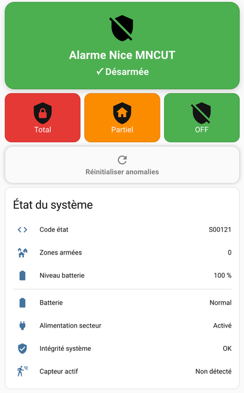
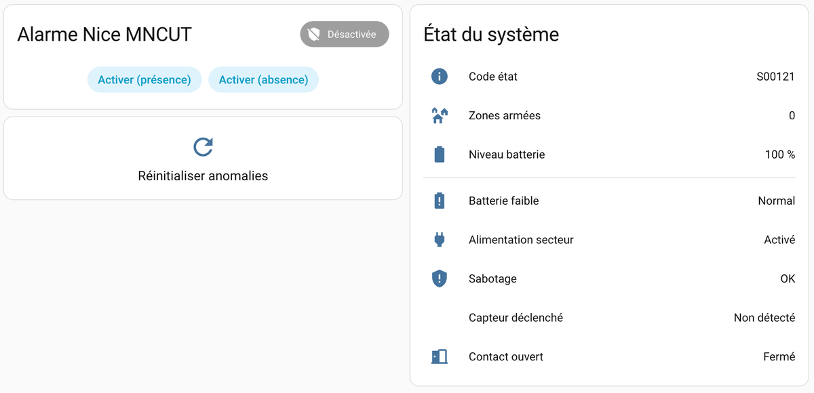
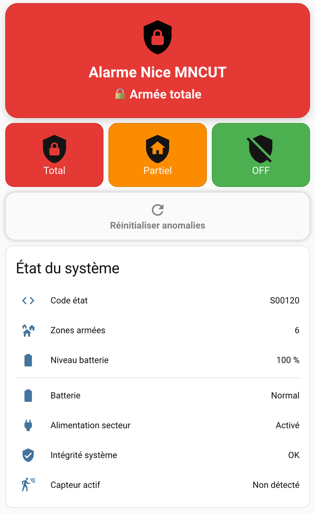
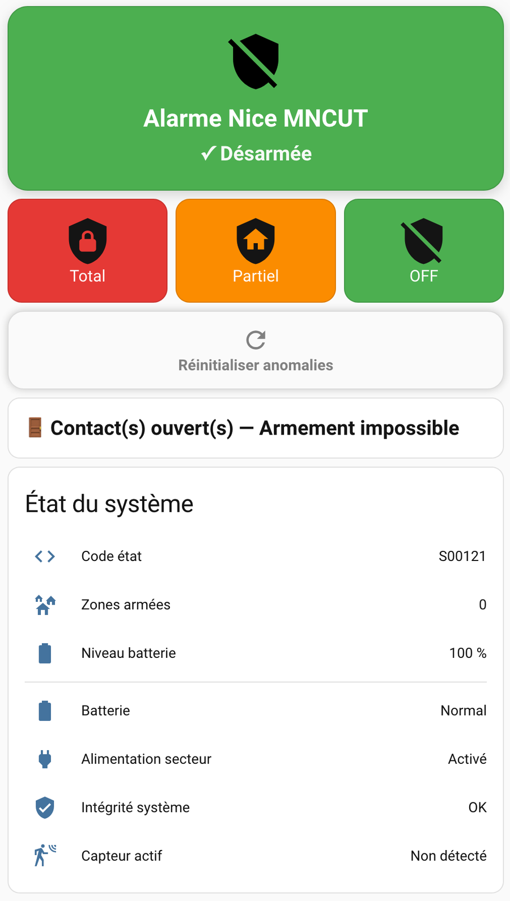

# Nice MNCUT — Intégration Home Assistant

[](https://github.com/hacs/integration)


🇬🇧 [Read in English](README.md)

Intégration Home Assistant pour la centrale d'alarme **Nice MNCUT**, utilisant une connexion WebSocket locale (aucun cloud requis).



---

## 🎯 Contexte du projet

Ce dépôt repose sur un projet personnel réel de domotique et vise également à démontrer un travail d'intégration solide autour de :

- l'architecture des intégrations personnalisées Home Assistant
- une communication locale-first sans dépendance au cloud
- la gestion d'état en temps réel via WebSocket
- une utilisation pratique dans un tableau de bord et une distribution HACS

---

## 🧠 Contexte technique

Cette intégration a été développée après une phase de rétro-ingénierie du système Nice MNCUT.

Le travail a inclus :

- l'analyse des échanges WebSocket entre l'interface web et la centrale d'alarme
- l'analyse du code de l'interface web de l'alarme
- l'identification des formats de messages et des transitions d'état
- la reconstruction d'une couche de communication fiable pour Home Assistant

Cette approche a permis de construire une intégration entièrement locale et en temps réel, sans dépendre d'une API officielle ni d'un service cloud.

---

## ✨ Fonctionnalités

- 🔒 Armement / désarmement / armement partiel via Home Assistant
- 📡 Mises à jour d'état en temps réel via WebSocket (`local_push`)
- 🔋 Suivi du niveau de batterie (%)
- ⚡ État de l'alimentation secteur
- 🚨 Détection des sabotages, contacts ouverts et capteurs déclenchés
- ⏱️ Décompte du délai de sortie
- 🛠️ Service d'acquittement des anomalies (`clear_anomalies`)
- 🌐 Multilingue : anglais et français

---

## 📋 Prérequis

- Home Assistant **2023.1 ou plus récent**
- Centrale d'alarme Nice MNCUT accessible sur votre réseau local
- Port WebSocket **4012** accessible depuis Home Assistant

---

## 📦 Installation

### Via HACS (recommandé)

1. Ouvrez **HACS → Integrations**
2. Cliquez sur les trois points (en haut à droite) → **Custom repositories**
3. Ajoutez l'URL de ce dépôt et sélectionnez la catégorie **Integration**
4. Recherchez **Nice MNCUT** et installez l'intégration
5. Redémarrez Home Assistant

### Manuelle

Copiez `custom_components/nice_mncut` dans `/config/custom_components/` puis redémarrez Home Assistant.

---

## ⚙️ Configuration

1. Allez dans **Settings → Devices & Services → Add Integration**
2. Recherchez **Nice MNCUT**
3. Saisissez :
   - l'**adresse IP** de votre centrale MNCUT
   - le **code PIN**

---

## 🖥️ Exemples de tableaux de bord

- [Simple : `examples/dashboard_simple.yaml`](examples/dashboard_simple.yaml)
- [Premium : `examples/dashboard_premium.yaml`](examples/dashboard_premium.yaml)

### 🧩 Tableau de bord simple

<p align="center">
  
</p>

### ✨ Tableau de bord premium

<p align="center">
  <br><br>
  <br><br>
  
</p>

---

## 🧩 Entités

| Entité                                          | Type            | Description                              |
| ----------------------------------------------- | --------------- | ---------------------------------------- |
| `alarm_control_panel.nice_mncut`                | Panneau alarme  | Contrôle principal d'armement/désarmement |
| `binary_sensor.nice_mncut_batterie_faible`      | Capteur binaire | Alerte de batterie faible                |
| `binary_sensor.nice_mncut_alimentation_secteur` | Capteur binaire | Alimentation secteur OK                  |
| `binary_sensor.nice_mncut_sabotage`             | Capteur binaire | Alerte de sabotage                       |
| `binary_sensor.nice_mncut_contact_ouvert`       | Capteur binaire | Contact ouvert détecté                   |
| `binary_sensor.nice_mncut_capteur_declenche`    | Capteur binaire | Capteur de mouvement déclenché           |
| `binary_sensor.nice_mncut_panique`              | Capteur binaire | Alarme panique                           |
| `binary_sensor.nice_mncut_mode_maintenance`     | Capteur binaire | Mode maintenance                         |
| `sensor.nice_mncut_etat_brut`                   | Capteur         | Code d'état brut de la centrale          |
| `sensor.nice_mncut_zones_armees`                | Capteur         | Nombre de zones armées                   |
| `sensor.nice_mncut_niveau_batterie`             | Capteur         | Niveau de batterie (%)                   |
| `sensor.nice_mncut_delai_de_sortie`             | Capteur         | Décompte du délai de sortie (s)          |

---

## 🛠️ Services

### `nice_mncut.clear_anomalies`

Acquitte les anomalies (sabotage, contact ouvert, etc.) afin de permettre le réarmement.

| Champ   | Requis | Défaut   | Description                        |
| ------- | ------ | -------- | ---------------------------------- |
| `areas` | Non    | `123456` | Identifiants des zones à acquitter |

Exemple :

```yaml
service: nice_mncut.clear_anomalies
data:
  areas: "123456"
```

---

## 📊 États pris en charge

| État HA       | Description                       |
| ------------- | --------------------------------- |
| `disarmed`    | Centrale désarmée                 |
| `arming`      | Délai de sortie en cours          |
| `armed_away`  | Armement total (toutes les zones) |
| `armed_home`  | Armement partiel (mode présence)  |
| `disarming`   | Désarmement en cours              |
| `unavailable` | Centrale injoignable              |

---

## 🐛 Dépannage

**L'intégration ne se connecte pas :**

- Vérifiez l'adresse IP et que le port 4012 est ouvert
- Consultez les journaux HA : `Settings → System → Logs`, filtrez par `nice_mncut`

**Impossible de réarmer après une anomalie :**

- Utilisez d'abord le service `nice_mncut.clear_anomalies`

---

## 🧰 Workflow d'ingénierie

Ce projet reflète également un workflow de développement moderne construit autour de VS Code, de la rétro-ingénierie et d'outils de codage assisté par IA tels que Codex et Claude Code.

Ces outils ont été utilisés pour accélérer l'implémentation, l'analyse du protocole, la documentation et les cycles d'itération, tandis que la compréhension du système, les décisions d'architecture, la validation et les choix techniques finaux sont restés sous le contrôle de l'auteur.

---

## 🤝 Contribuer

Les issues et contributions sont les bienvenues !

---

## ⚠️ Avertissement

Non affilié à Nice S.p.A.

---

## 📄 Licence

MIT License
